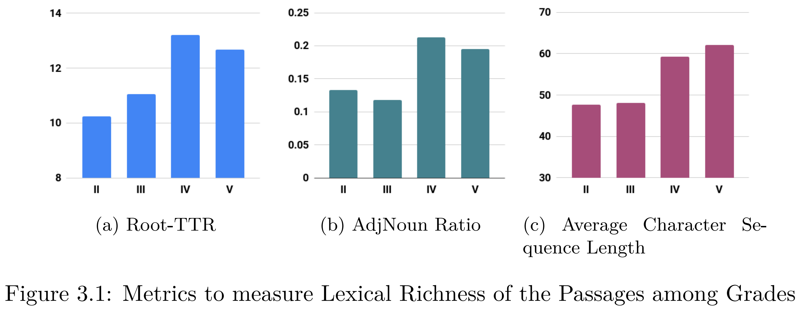

# HindiRC-Data
This repo contains data for HindiRC. Please cite [our paper](https://www.researchgate.net/publication/342424208_HindiRC_A_Dataset_for_Reading_Comprehension_in_Hindi) when using our dataset.

#### About HindiRC
HindiRC is the first Reading Comprehension dataset for Hindi. 

The dataset has been split into grades 2-5 according the educational reading proficiency.



The data has been sourced from educational websites [https://sandeepbarouli.com/](https://sandeepbarouli.com/) and [2classnotes](https://www.2classnotes.com/). Hence, it is completely natural and formal.


#### Xml Schema of the Dataset
* Reading Comprehension consists of a passage, &lt;passage&gt; and a set of questions, &lt;q&gt;. 
* For HindiRC, the answers &lt;a&gt; belong to the passage.
* The index of these answers in the passage is given in &lt;l&gt;.
* If an answer spans multiple sentences, we consider the most important sentence only. However, the dataset does provide the index of these sentences is given in &lt;lg&gt;.
* Additionally, the dataset also provides a copy of the passage with all anaphors resolved. 

The following tags have been used:
|                                     Data                                    |      Xml tags      |
|:---------------------------------------------------------------------------:|:------------------:|
| Passage - raw data                                                          | &lt;passage&gt;          |
| Passage data with anaphoras replaced with referent. This was done manually. | &lt;anaphoraresolved&gt; |
| Stemmed version of the passage                                              | &lt;stemmed&gt;          |
| Question - raw data                                                         | &lt;q&gt;                |
| Answer - raw data                                                           | &lt;a&gt;                |
| Answer - index in passage                                                   | &lt;l&gt;                |
| Multi sentence answer - index in passage                                    | &lt;lg&gt;               |


### References
Please cite our paper when using this dataset:

Kaveri Anuranjana*, Vijjini Anvesh Rao*, Radhika Mamidi,
"[HindiRC: A Dataset for Reading Comprehension in Hindi](https://www.researchgate.net/publication/342424208_HindiRC_A_Dataset_for_Reading_Comprehension_in_Hindi)", 20<sup>*th*</sup> International Conference on Computational Linguistics and Intelligent Text Processing, CICLing, 2019.


```
@inproceedings{anuranjana2019hindirc,
  title     = {HindiRC: A Dataset for Reading Comprehension in Hindi},
  author    = {Anuranjana, Kaveri and Rao, Vijjini and Mamidi, Radhika},
  booktitle = {20th International Conference on Computational Linguistics and Intelligent Text},
  year      = {2019}
}

```